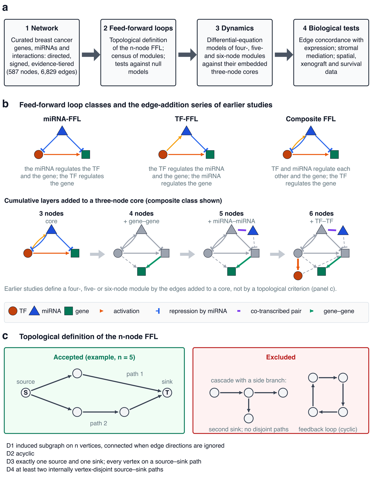
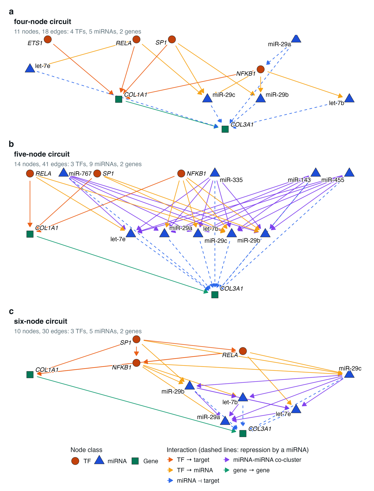
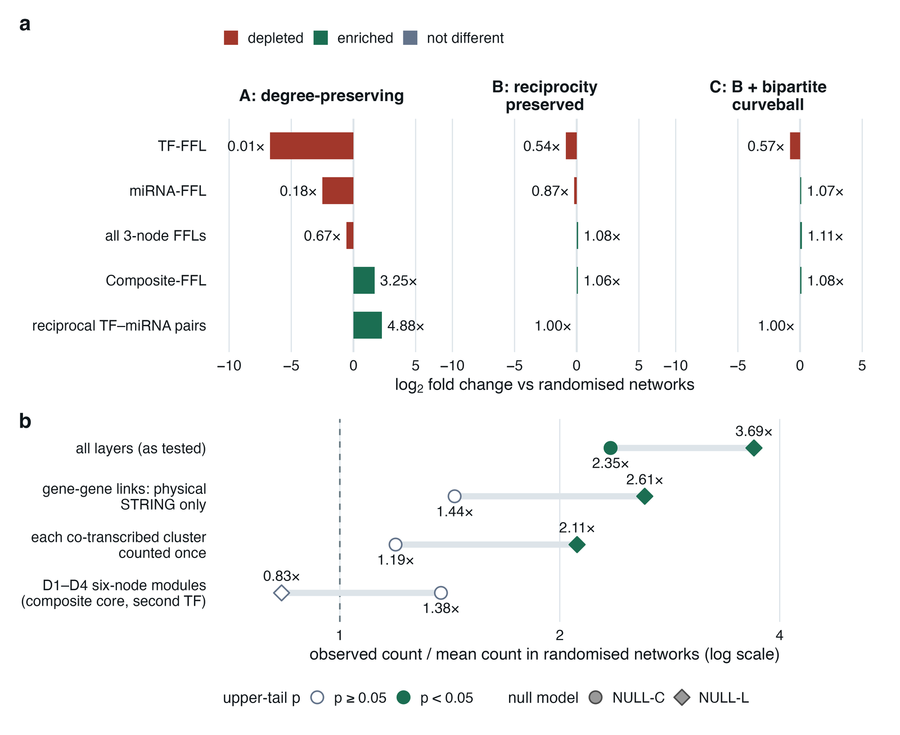
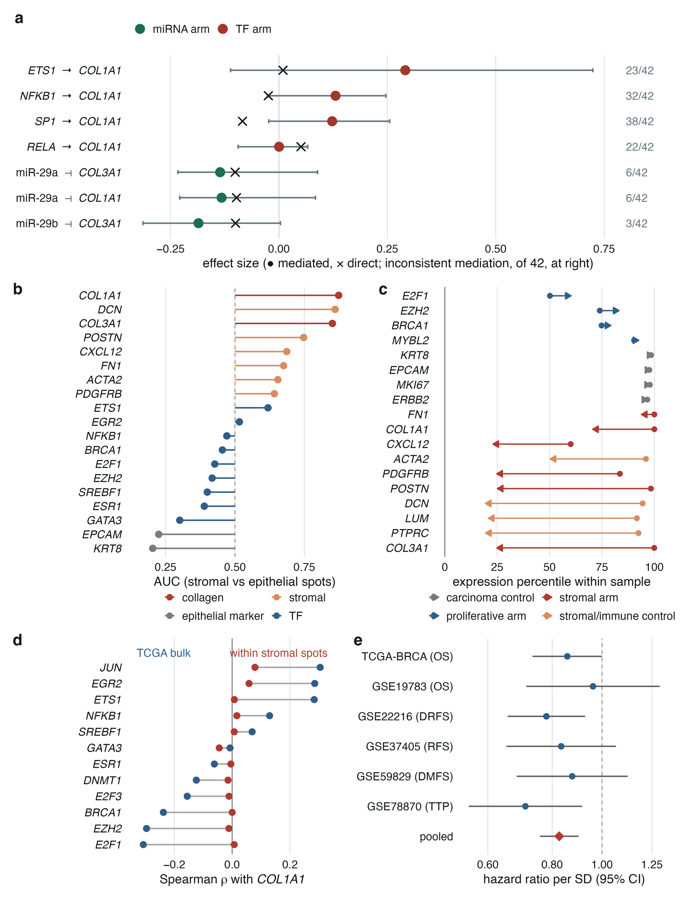
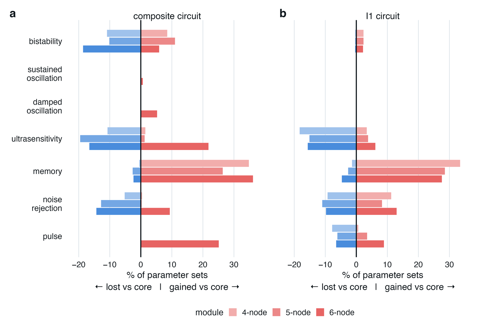
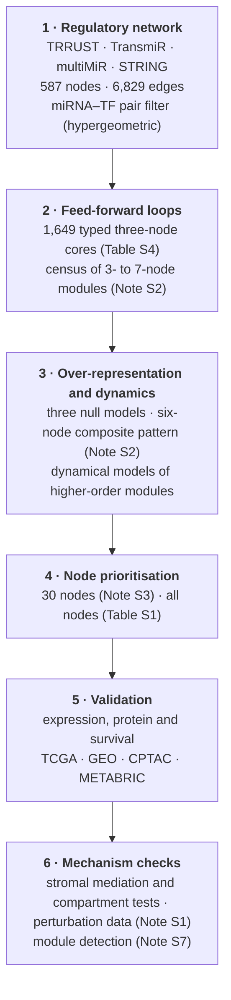

# Six-node feed-forward loops in the breast cancer regulatory network

**Code, regulatory network and result tables for**

*Deciphering the Transcriptional Regulation of Breast Cancer Genes through a Novel Six-Node Feed-Forward Loop Analysis*

Gayam Prasanna Kumar Reddy · Jesil Mathew A · Fayaz Shaik Mahammad

*Functional & Integrative Genomics* (under revision)

---

## At a glance

| | |
|---|---|
| **Regulatory network** | 587 nodes (157 TFs, 223 miRNAs, 207 genes); 6,829 directed edges in the analysed network |
| **Edge classes** | miRNA → gene 3,266 · miRNA → TF 1,553 · TF → miRNA 1,239 · TF → gene 681 · TF → TF 89 · gene–gene 1 |
| **Three-node FFL cores** | 1,649 typed cores: 1,434 composite, 206 miRNA-FFL and 9 TF-FFL (Table S4) |
| **Higher-order census** | 116,505 four-node, 1,506,263 five-node and 19,401,840 six-node modules (Supplementary Note S2; Fig. S2) |
| **Prioritised nodes** | 30: the 10 highest-ranked TFs, genes and miRNAs (Supplementary Note S3; Fig. S4; all nodes in Table S1) |
| **FFL networks** | 12 files ready for Cytoscape: miRNA-, TF- and composite FFLs at three to six nodes ([`data/ffl_networks/`](data/ffl_networks)) |

  

<b>Fig. 1</b> Study design, feed-forward loop classes and the topological definition of the <i>n</i>-node FFL

## Start here

1. **Install and set up:** `pip install -r requirements.txt` and `Rscript install_r_packages.R` (details in
   [`docs/software/`](docs/software)), then `python3 set_root.py`, which points every script at this folder and links
   the network files where the scripts read them (`python3 set_root.py --undo` reverses it).
2. **Explore:** [`ANALYSIS_GUIDE.ipynb`](ANALYSIS_GUIDE.ipynb) follows the paper section by section. For each analysis it
   names the scripts and loads the file behind each reported number. It reads only files in this repository and needs
   only pandas.
3. **Use the networks:** [`data/network/`](data/network) holds the regulatory network, [`data/ffl_networks/`](data/ffl_networks)
   one network per FFL type, and [`supplementary_tables/`](supplementary_tables) Tables S1–S9 as CSV.
4. **Reproduce a step:** [`scripts/`](scripts) is grouped by analysis in the order of the paper; each folder's README
   gives its run order. For example, `python3 scripts/02_pair_filter/hypergeometric_pair_filter.py` recomputes the
   miRNA–TF pair filter from `data/pair_filter/` with the standard library alone.

## Figures of the paper

Each figure is drawn by one script in [`scripts/15_figures_and_tables/`](scripts/15_figures_and_tables). Click a
figure for the full-size image.

<table>
<tr>
<td width="50%" align="center"> <b>Fig. 2</b> The exemplar circuits, drawn as directed signed graphs <code>72_fig2_exemplar_circuits.R</code></td>
<td width="50%" align="center"> <b>Fig. 3</b> Over-representation of three-node FFLs and of the six-node composite pattern under null models <code>71_fig3_nulls_sixnode.R</code></td>
</tr>
<tr>
<td width="50%" align="center"> <b>Fig. 4</b> Stromal mediation, compartment occupancy and the hsa-miR-29a association with survival <code>73_fig4_compartment_mir29a.R</code></td>
<td width="50%" align="center"> <b>Fig. 5</b> Behaviours gained and lost by higher-order modules relative to their three-node cores <code>62_fig5_gain_loss.R</code></td>
</tr>
</table>

Fig. 1 is drawn by `74_fig1_concept.py`. Supplementary figures: S1 `20_figures_core.R`; S2, S3 and S6
`70_fig_supp_census_coherence_concordance.R`; S4 `13_fig_prioritisation.R`; S5
`analyses/analysed_network_reruns/figure_fixes/fig_s5_information_flow_notitles.py`; S7 `61_figS7_reactive_stroma.R`.

## Repository map

| Folder | Contents |
|---|---|
| [`data/`](data) | The regulatory network ([`network/`](data/network)), the FFL networks ([`ffl_networks/`](data/ffl_networks)), the miRNA–TF pair filter ([`pair_filter/`](data/pair_filter)) and the curation rules ([`curation/`](data/curation)) |
| [`scripts/`](scripts) | The code of the main analysis, grouped by analysis: `01_network_assembly` … `15_figures_and_tables` |
| [`analyses/`](analyses) | Later, self-contained analyses with their code, inputs and outputs: census and motif null models, the six-node pattern, the twelve networks of Bhat et al. (2024), perturbation-data tests and re-runs on the analysed network |
| [`results/`](results) | The outputs of `scripts/`, in the folders the scripts write to |
| [`supplementary_tables/`](supplementary_tables) | Supplementary Tables S1–S9 |
| [`docs/`](docs) | Software versions, the file manifest (MD5), the script index, run logs, and every file named in the Supplementary Notes with its path here |
| `requirements.txt`, `install_r_packages.R` | Python and R dependencies, pinned to the versions used |

## Workflow

## Reproducing the analyses

<b>Software, paths and random seeds</b>

 

The analysis ran on Ubuntu 22.04.5 LTS with R 4.5.1 (Bioconductor 3.21), Python 3.13.13 and gcc 10.5.0.
`requirements.txt` pins the Python packages the scripts import, and `install_r_packages.R` installs the R packages at
the versions used (CRAN, Bioconductor, CRAN archive and GitHub; the full list is in `docs/software/r_packages.tsv`).
Command-line tools used by some scripts: gcc and g++, bedtools, bigBedToBed (UCSC) and curl. The Enformer and Borzoi
steps need an NVIDIA GPU; they ran on an RTX A4000 (16 GB).

Scripts address the analysis root as `/path/to/revision`. `python3 set_root.py` replaces it with the path of this
repository, so that `scripts/`, `results/` and `analyses/` resolve as they are here, and links the network files of
`data/network/` into `data/`, where the scripts read them. Three other placeholders mark locations outside the
repository that you set yourself: `/path/to/home/Desktop/DD/R_GPR/` (raw inputs of the first analysis round),
`/path/to/scratch` (a working folder for downloads and intermediate files) and `/path/to/home/bin/bigBedToBed` (the UCSC
bigBedToBed program). Four deconvolution scripts load packages from a separate R library, `~/Rlib_deconv2`, which keeps
their versions apart from the main library. Random seeds are fixed in the scripts, and randomisation and bootstrap
procedures use 1,000 iterations unless stated otherwise. The NCBI E-utilities scripts need your own e-mail address in
place of `your.email@example.org`.

Each folder README lists every script of the folder with one line on what it does. Within a folder, scripts run in
the order of their numbers unless the README says otherwise. [`docs/PAPER_MAP.md`](docs/PAPER_MAP.md) gives, for each
figure, table and Results section, the scripts behind it and the files they wrote.

<b>Compiled programs</b>

 

The C programs are given as source. Build each with gcc:

| Program | Command |
|---|---|
| `scripts/03_ffl_census/ffl_enum.c`, `ffl_enum2.c` | `gcc -O3 -march=native -fopenmp` (the build line in each file) |
| `scripts/03_ffl_census/reconcile_05_census_greedy_vs_maxflow.c`, `census_09_esu_classmask.c` | `gcc -O2 -o <name> <name>.c -lm` |
| `analyses/census_and_motif_nulls/census/ffl_census_composition.c` and `nulls/v2_null.c` | in `analyses/census_and_motif_nulls/run_all.sh` (`gcc -O3 -march=native` and `gcc -O2`) |
| `analyses/six_node_pattern/S7/v2_null.c` | `gcc -O2` |
| `analyses/six_node_pattern/S7/ffl_census_composition.c` | `gcc -O3 -march=native` |
| `analyses/six_node_pattern/S1/s1_null6.c`, `F/F4/f4_node_union.c` | `gcc -O2 -o <name> <name>.c -lm` |
| `analyses/bhat_pattern_analysis/scripts/bhat_null.c` | compiled by the scripts that use it, with `gcc -O2` |

<b>Data that are not redistributed</b>

 

The analyses use public resources whose terms do not allow redistribution of patient-level or licensed data, so only
derived results are deposited. To re-run the scripts, download:

- TCGA-BRCA gene and miRNA expression, clinical and survival data: UCSC Xena (https://xenabrowser.net/), TCGA Pan-Cancer clinical resource.
- CPTAC-BRCA proteome: Proteomic Data Commons. METABRIC: cBioPortal.
- GEO series: GSE176078, GSE19783, GSE96058, GSE42568, GSE45827, GSE10780, GSE25066, GSE20194, GSE41998, GSE22093, GSE23988, GSE32646, GSE42822, GSE22216, GSE37405, GSE59829, GSE78870, GSE28969, GSE73002.
- DepMap (CRISPR, CCLE): https://depmap.org. Human Protein Atlas (v25.1; v23.0 archive): https://www.proteinatlas.org.
- NCI Patient-Derived Models Repository: https://pdmr.cancer.gov. 10x Genomics public Visium breast sections.
- GWAS Catalog (v1.0.2, GRCh38): https://www.ebi.ac.uk/gwas.
- Interaction and gene-disease resources: DisGeNET v7.0, GeneCards, miRTarBase v9.0, miRWalk v3, TarBase, miRecords (via multiMiR), TRRUST v2, TransmiR v2.0, hTFtarget, TcoF-DB v2, dbCoRC, STRING v12, HMDD v4.0, miR2Disease, PhenomiR 2.0, miRBase v22.
- TCGA-derived resources: MC3 mutation calls, ABSOLUTE purity, the immune estimates of Thorsson et al., TCGA-BRCA ATAC-seq (Genomic Data Commons); MET500 and the pan-cancer matrices (UCSC Xena); the CIBERSORT LM22 signature matrix.
- Regulatory annotation: ENCODE ATAC-seq and DNase-seq, ReMap 2022, ChIP-Atlas, JASPAR 2024, HOCOMOCO v11, FANTOM5, GENCODE, GTEx v8 eQTLs, KnockTF 2.0 and LINCS signatures.
- Gene sets and drug–gene interactions: MSigDB (through msigdbr), Enrichr libraries, DGIdb.
- Single-cell, cohort and miRNA atlases: the Human Breast Cell Atlas, SCAN-B (GSE96058) and the microRNAome.
- Cell-line screens: GDSC2, PRISM, Project Score and BioGRID ORCS.
- OncoKB and COSMIC gene lists (licensed; not included).

The scripts keep these downloads under `data/` (`depmap/`, `depmap24q4/`, `hpa/`, `gwas/`, `deconv/`, `ccle/`, `atac/`,
`brca_clinicalMatrix.tsv`, `CCLE_rnaseq_tpm.txt.gz`) and `cache/`.

Not deposited from the analysis root:

- `data/brca_*.rds`: patient-level TCGA data, built from the TCGA-BRCA downloads above by
  `scripts/07_expression_validation/tcga_differential_expression/01_tcga_brca_prep_de.R` and `scripts/10_survival_and_clinical/cox_models/10_survival_cox_hubs.R`.
- `data/ffl_module_sets.rds`: built by `scripts/03_ffl_census/11_ffl_module_membership.R`.
- `data/db/`: the TRRUST v2 and TransmiR v2.0 downloads.
- `cache/`: public downloads, and intermediate files that the scripts write and read back (they are recreated when the
  scripts of a folder run in order). The downloads are the STRING v12 protein aliases and information files for human (9606); the
  TargetScan 8.0 miRNA family file (`miR_Family_Info.txt`); and, for the sequence-model tests, 600-kb hg38 windows around
  *COL1A1* and *COL3A1*, the Enformer and Borzoi target tables, UCSC RefSeq Select and the Borzoi weights (Hugging Face
  `johahi/borzoi-replicate-0` to `-3`). The exception is `string_symbol_map_exact.tsv`, which is in `data/network/`.

## Citation

If you use this code or these data, please cite:

> Gayam Prasanna Kumar Reddy, Jesil Mathew A, Fayaz Shaik Mahammad. Deciphering the Transcriptional Regulation of Breast
> Cancer Genes through a Novel Six-Node Feed-Forward Loop Analysis. *Functional & Integrative Genomics* (under revision).

## Licence

Code: MIT licence ([`LICENSE`](LICENSE)). Derived data and result tables: CC BY 4.0.

## Contact

Corresponding author: Fayaz Shaik Mahammad, Manipal Institute of Technology, Manipal Academy of Higher Education,
Manipal, Karnataka 576104, India (fayaz.shaik@manipal.edu).
