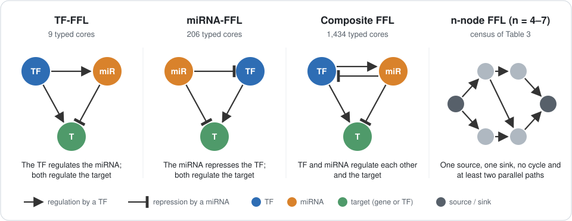
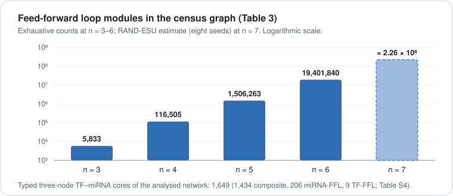
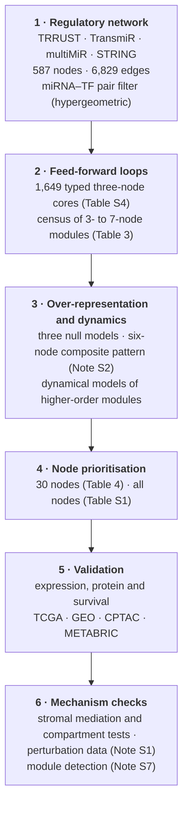

# Six-node feed-forward loops in the breast cancer regulatory network

**Code, regulatory network and result tables for**

*Deciphering the Transcriptional Regulation of Breast Cancer Genes through a Novel Six-Node Feed-Forward Loop Analysis*

Gayam Prasanna Kumar Reddy · Jesil Mathew A · Fayaz Shaik Mahammad

*Functional & Integrative Genomics* (under revision)

---

## At a glance

| | |
|---|---|
| **Regulatory network** | 587 nodes (157 TFs, 223 miRNAs, 207 genes); 6,829 directed edges in the analysed network |
| **Edge classes** | miRNA → gene 3,266 · miRNA → TF 1,553 · TF → miRNA 1,239 · TF → gene 681 · TF → TF 89 · gene–gene 1 |
| **Three-node FFL cores** | 1,649 typed cores: 1,434 composite, 206 miRNA-FFL and 9 TF-FFL (Table S4) |
| **Higher-order census** | 116,505 four-node, 1,506,263 five-node and 19,401,840 six-node modules (Table 3) |
| **Prioritised nodes** | 30: the ten highest-ranked TFs, genes and miRNAs (Table 4; all nodes in Table S1) |
| **FFL networks** | 12 files ready for Cytoscape: miRNA-, TF- and composite FFLs at three to six nodes ([`data/ffl_networks/`](data/ffl_networks)) |

  

  

## Start here

1. **Install:** `pip install -r requirements.txt` and `Rscript install_r_packages.R` (details in [`docs/software/`](docs/software)).
2. **Explore:** [`ANALYSIS_GUIDE.ipynb`](ANALYSIS_GUIDE.ipynb) follows the paper section by section. For each analysis it
   names the scripts and loads the file behind each reported number. It reads only files in this repository and needs
   only pandas.
3. **Use the networks:** [`data/network/`](data/network) holds the regulatory network, [`data/ffl_networks/`](data/ffl_networks)
   one network per FFL type, and [`supplementary_tables/`](supplementary_tables) Tables S1–S9 as CSV.
4. **Reproduce a step:** [`scripts/`](scripts) is grouped by analysis in the order of the paper; each folder's README
   gives its run order. For example, `python3 scripts/02_pair_filter/hypergeometric_pair_filter.py` recomputes the
   miRNA–TF pair filter from `data/pair_filter/` with the standard library alone.

## Repository map

| Folder | Contents |
|---|---|
| [`data/`](data) | The regulatory network ([`network/`](data/network)), the FFL networks ([`ffl_networks/`](data/ffl_networks)), the miRNA–TF pair filter ([`pair_filter/`](data/pair_filter)) and the curation rules ([`curation/`](data/curation)) |
| [`scripts/`](scripts) | The code of the main analysis, grouped by analysis: `01_network_assembly` … `15_figures_and_tables` |
| [`analyses/`](analyses) | Later, self-contained analyses with their code, inputs and outputs: census and motif null models, the six-node pattern, perturbation-data tests and re-runs on the analysed network |
| [`results/`](results) | The outputs of `scripts/`, in the folders the scripts write to |
| [`supplementary_tables/`](supplementary_tables) | Supplementary Tables S1–S9 |
| [`docs/`](docs) | Software versions, the file manifest (MD5), the script index, run logs, and every file named in the Supplementary Notes with its path here |
| `requirements.txt`, `install_r_packages.R` | Python and R dependencies, pinned to the versions used |

## Workflow

## Reproducing the analyses

<b>Software, paths and random seeds</b>

 

The analysis ran on Ubuntu 22.04.5 LTS with R 4.5.1 (Bioconductor 3.21), Python 3.13.13 and gcc 10.5.0.
`requirements.txt` pins the Python packages the scripts import, and `install_r_packages.R` installs the R packages at
the versions used (CRAN, Bioconductor, CRAN archive and GitHub; the full list is in `docs/software/r_packages.tsv`).
Command-line tools used by some scripts: gcc and g++, bedtools, bigBedToBed (UCSC) and curl. The Enformer and Borzoi
steps need an NVIDIA GPU; they ran on an RTX A4000 (16 GB).

Scripts use absolute paths under the original analysis root, shown as the placeholder `/path/to/revision`. Set it to
the root of this repository: `scripts/`, `results/` and `analyses/` then resolve as they are here. The network files
that the scripts read from `data/` are in `data/network/`, and a few scripts read raw inputs from sibling folders of
the project, shown as `/path/to/home/Desktop/DD/R_GPR/`. Random seeds are fixed in the scripts, and randomisation and
bootstrap procedures use 1,000 iterations unless stated otherwise. The NCBI E-utilities scripts need your own e-mail
address in place of `your.email@example.org`.

<b>Compiled programs</b>

 

The C programs are given as source; build each with gcc. The recorded commands are:

| Program | Command |
|---|---|
| `analyses/census_and_motif_nulls/census/ffl_census_composition.c` and `nulls/v2_null.c` | in `analyses/census_and_motif_nulls/run_all.sh` (`gcc -O3 -march=native` and `gcc -O2`) |
| `analyses/six_node_pattern/S7/v2_null.c` | `gcc -O2` |
| `analyses/six_node_pattern/S7/ffl_census_composition.c` | `gcc -O3 -march=native` |
| `analyses/six_node_pattern/S1/s1_null6.c`, `F/F4/f4_node_union.c` | `gcc -O2 -o <name> <name>.c -lm` |

The flags used for `scripts/03_ffl_census/ffl_enum.c`, `ffl_enum2.c` and the other census programs of that folder were not
recorded; `scripts/04_motif_significance/v2_null.c` is the program that `run_all.sh` compiles with `gcc -O2`.

<b>Inputs of particular scripts</b>

 

- The TCGA-BRCA R objects that `analyses/six_node_pattern/E/E6` and `S8` read (`data/brca_*.rds`) are built by
  `scripts/07_expression_validation/tcga_differential_expression/01_tcga_brca_prep_de.R` and `scripts/10_survival_and_clinical/cox_models/10_survival_cox_hubs.R` from the downloads listed below.
- `analyses/six_node_pattern/S7/s7b_restricted_gene_gene.py` reads the STRING v12 downloads, and
  `analyses/six_node_followups/Q7` the TargetScan 8.0 miRNA family file.
- `analyses/six_node_pattern/E/E5/e5a_hypergeometric_filter.py` and `analyses/six_node_followups/Q123`, `Q5` and `Q9`
  take the authors' pair-filter archive as an argument; its files are in `data/pair_filter/`.
- The two scripts of `analyses/six_node_pattern/S5` read `results/v5/tables/TableS1_all_interactions.csv` (the published
  Table S2). They were run on an earlier copy that differs only in the sign columns of 497 edges without an annotated
  sign, which these scripts do not read.
- The perturbation-data tests read, besides public downloads, the network tables, `results/v3/seqreg_ext_occlusion_allsites.csv`,
  TRRUST v2 and, for `P2/p2_analyse.py`, the six-node composite instances of `analyses/six_node_pattern/S1`.

<b>Data that are not redistributed</b>

 

The analyses use public resources whose terms do not allow redistribution of patient-level or licensed data, so only
derived results are deposited. To re-run the scripts, download:

- TCGA-BRCA gene and miRNA expression, clinical and survival data: UCSC Xena (https://xenabrowser.net/), TCGA Pan-Cancer clinical resource.
- CPTAC-BRCA proteome: Proteomic Data Commons. METABRIC: cBioPortal.
- GEO series: GSE176078, GSE19783, GSE96058, GSE42568, GSE45827, GSE10780, GSE25066, GSE20194, GSE41998, GSE22093, GSE23988, GSE32646, GSE42822, GSE22216, GSE37405, GSE59829, GSE78870, GSE28969, GSE73002.
- DepMap (CRISPR, CCLE): https://depmap.org. Human Protein Atlas (v25.1; v23.0 archive): https://www.proteinatlas.org.
- NCI Patient-Derived Models Repository: https://pdmr.cancer.gov. 10x Genomics public Visium breast sections.
- GWAS Catalog (v1.0.2, GRCh38): https://www.ebi.ac.uk/gwas.
- Interaction and gene-disease resources: DisGeNET v7.0, GeneCards, miRTarBase v9.0, miRWalk v3, TarBase, miRecords (via multiMiR), TRRUST v2, TransmiR v2.0, hTFtarget, TcoF-DB v2, dbCoRC, STRING v12, HMDD v4.0, miR2Disease, PhenomiR 2.0, miRBase v22.
- OncoKB and COSMIC gene lists (licensed; not included).

Not deposited from the analysis root:

- `data/brca_*.rds`: patient-level TCGA data, built as described above.
- `data/ffl_module_sets.rds`: built by `scripts/03_ffl_census/11_ffl_module_membership.R`.
- `data/db/`: the TRRUST v2 and TransmiR v2.0 downloads.
- `cache/`: public downloads. These are the STRING v12 protein aliases and information files for human (9606); the
  TargetScan 8.0 miRNA family file (`miR_Family_Info.txt`); and, for the sequence-model tests, 600-kb hg38 windows around
  *COL1A1* and *COL3A1*, the Enformer and Borzoi target tables, UCSC RefSeq Select and the Borzoi weights (Hugging Face
  `johahi/borzoi-replicate-0` to `-3`). The exception is `string_symbol_map_exact.tsv`, which is in `data/network/`.

<b>The miRNA–TF pair filter</b>

 

The miRNA–TF pair filter (cumulative hypergeometric statistic; Methods 2.1 of the paper) was run in the first analysis
round outside the scripts collected here. Its inputs and pair-level output are in [`data/pair_filter/`](data/pair_filter).
The filter's *P* value is the lower tail of the hypergeometric distribution, so the filter did not select pairs that
share more targets than expected, and the filter did not define the network, whose own files are in `data/network/`
(see `data/pair_filter/README.md`).

<b>Files to read with care</b>

 

- The `sign` column of `data/network/canonical_edges.tsv` is the original deposit's placeholder (+1 for every edge that
  is not miRNA→target). Literature-derived signs are in the layer files and in Table S2 (`sign`, `trrust_mode`,
  `transmir_mode`).
- `results/ffl_census_summary.csv`, `results/ffl_census.csv` and `results/ffl_higher_order.csv.gz` are the first census,
  on the graph that still holds the 30 exemplar miRNA–miRNA edges. The census the paper reports is
  `results/v2/census_rerun/census_all_graphs.csv`.
- The rank columns of `results/v5/node_prioritisation_full.csv` place the four unrankable miRNAs first; the ranks the
  paper reports are those of Table S1, recomputed from its `priority` column in `ANALYSIS_GUIDE.ipynb`.
- `results/v5/tables/` holds the tables under the analysis numbering; its README maps them to the published tables.
- The published Table S2 (`supplementary_tables/TableS2_all_interactions.csv`) differs from the output of
  `scripts/15_figures_and_tables/21_tables.R` by three later corrections. Edges without an annotated sign have an empty `sign`, where the
  script copied the placeholder of `canonical_edges.tsv`. The 521 repression edges (136 TRRUST, 385 TransmiR) have
  `sign` −1, as their `trrust_mode` and `transmir_mode` state and as every analysis used. The `in_analysed_network`
  column, written by `analyses/analysed_network_reruns/tables/flag_tableS1.py`, is FALSE for the 30 exemplar
  miRNA–miRNA edges.
- `results/v7/mcode_19_headline_summary.csv` was compiled by hand from the files `mcode_00` to `mcode_18` of the same
  folder, which hold its values.
- No saved script wrote `results/v6/atac_encode_compartment_specificity_tests.csv`;
  `scripts/09_regulatory_evidence/encode_accessibility/atac_compartment_specificity_tests_rebuild.py` rebuilds it byte for byte from
  `results/v6/atac_encode_region_accessible.csv` and writes the rebuilt copy and a summary next to itself.

## Citation

If you use this code or these data, please cite:

> Gayam Prasanna Kumar Reddy, Jesil Mathew A, Fayaz Shaik Mahammad. Deciphering the Transcriptional Regulation of Breast
> Cancer Genes through a Novel Six-Node Feed-Forward Loop Analysis. *Functional & Integrative Genomics* (under revision).

## Licence

Code: MIT licence ([`LICENSE`](LICENSE)). Derived data and result tables: CC BY 4.0.

## Contact

Corresponding author: Fayaz Shaik Mahammad, Manipal Institute of Technology, Manipal Academy of Higher Education,
Manipal, Karnataka 576104, India (fayaz.shaik@manipal.edu).
